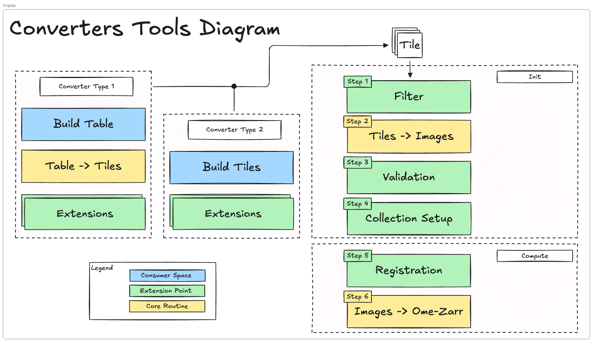

# ome-zarr-converters-tools

[](https://github.com/BioVisionCenter/ome-zarr-converters-tools/raw/main/LICENSE)
[](https://pypi.org/project/ome-zarr-converters-tools)
[](https://python.org)
[](https://github.com/BioVisionCenter/ome-zarr-converters-tools/actions/workflows/ci.yml)
[](https://codecov.io/gh/BioVisionCenter/ome-zarr-converters-tools)

OME-Zarr Converters Tools is a Python package that provides tooling for building OME-Zarr converters for the Fractal platform.

## Features

1. Abstraction layer for building OME-Zarr Image/HCS plates from the microscope metadata and image data 
2. A fully customizable pipeline for filtering, validanting, and tiling images
3. Python API for building custom converters, and fractal utilities for building converters tasks in fractal.

### Converters Tools Diagram



## Getting Started

To get started with OME-Zarr Converters Tools, you can install it via pip:

```bash
pip install ome-zarr-converters-tools
```

## Documentation

For detailed documentation on how to use OME-Zarr Converters Tools, please refer to the [official documentation](https://BioVisionCenter.github.io/ome-zarr-converters-tools/).

We also provide a minimal step-by-step guide to how to create a converter. You can find it in the [tutorial](https://BioVisionCenter.github.io/ome-zarr-converters-tools/stable/tutorial/) section of the documentation.
