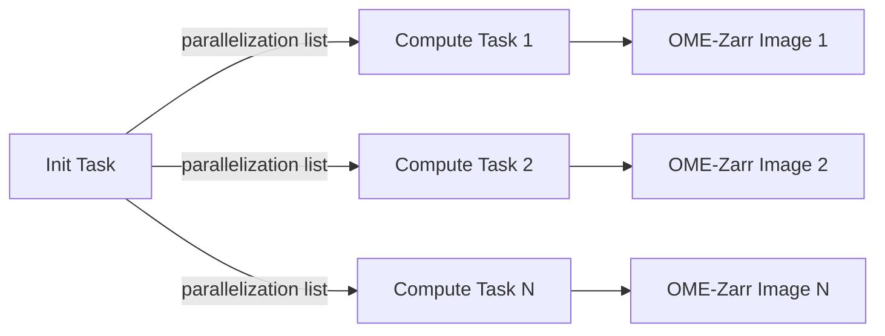

# Building Converters as Fractal Tasks

The [Fractal platform](https://fractal-analytics-platform.github.io/fractal-server/) enables parallel processing of image conversion tasks.
`ome-zarr-converters-tools` provides utilities to integrate with Fractal's **init/compute task model**, where:

- An **init task** sets up the output structure and creates a parallelization list
- Multiple **compute tasks** run independently (one per image), each converting a `TiledImage` to OME-Zarr

This page shows how to build a converter that plugs into the Fractal workflow.

## Overview

The Fractal integration builds on the same pipeline used in the tutorials.
The difference is that the init task serializes `TiledImage` objects to JSON and the compute tasks
deserialize and process them independently.



## Init Task

The init task is responsible for:

1. Building `Tile` objects from your data source (DataFrame, custom parsing, etc.)
2. Aggregating them into `TiledImage` objects
3. Setting up the OME-Zarr collection structure (plates, wells)
4. Creating a parallelization list for the compute tasks

Use `setup_images_for_conversion()` which combines steps 3 and 4:

```python
from ome_zarr_converters_tools import (
    AcquisitionDetails,
    ChannelInfo,
    ConverterOptions,
    setup_images_for_conversion,
    tiles_aggregation_pipeline,
)
from ome_zarr_converters_tools.core import hcs_images_from_dataframe
from ome_zarr_converters_tools.models import OverwriteMode


def my_init_task(
    *,
    zarr_dir: str,
    tiles_csv_path: str,
    # ... your custom parameters
) -> list[dict]:
    """Init task: set up plates and build parallelization list."""
    import pandas as pd

    # Step 1: Build tiles from your data source
    acq = AcquisitionDetails(
        channels=[ChannelInfo(channel_label="DAPI")],
        pixelsize=0.65,
        z_spacing=5.0,
    )
    tiles_table = pd.read_csv(tiles_csv_path)
    tiles = hcs_images_from_dataframe(
        tiles_table=tiles_table,
        acquisition_details=acq,
        plate_name="MyPlate",
    )

    # Step 2: Aggregate tiles
    opts = ConverterOptions()
    tiled_images = tiles_aggregation_pipeline(
        tiles=tiles,
        converter_options=opts,
        resource="/path/to/image/data",
    )

    # Step 3+4: Set up collection and build parallelization list
    parallelization_list = setup_images_for_conversion(
        tiled_images=tiled_images,
        zarr_dir=zarr_dir,
        collection_type="ImageInPlate",
        converter_options=opts,
        overwrite_mode=OverwriteMode.OVERWRITE,
    )

    return parallelization_list
```

`setup_images_for_conversion()` does two things internally:

- Calls `setup_ome_zarr_collection()` to create the plate/well structure in the Zarr store
- Calls `build_parallelization_list()` to serialize each `TiledImage` to a temporary JSON file and return a list of `{"zarr_url": ..., "init_args": ...}` dictionaries

## Compute Task

Each compute task receives one entry from the parallelization list and converts a single `TiledImage`.
Use `generic_compute_task()` which handles JSON deserialization, the registration pipeline, writing, and cleanup:

```python
from ome_zarr_converters_tools import (
    ConvertParallelInitArgs,
    DefaultImageLoader,
    ImageInPlate,
    ImageListUpdateDict,
    generic_compute_task,
)


def my_compute_task(
    *,
    zarr_url: str,
    init_args: ConvertParallelInitArgs,
) -> ImageListUpdateDict:
    """Compute task: convert one TiledImage to OME-Zarr."""
    return generic_compute_task(
        zarr_url=zarr_url,
        init_args=init_args,
        collection_type=ImageInPlate,
        image_loader_type=DefaultImageLoader,
        resource="/path/to/image/data",
    )
```

`generic_compute_task()` internally:

1. Loads the `TiledImage` from its JSON dump (with retry logic for filesystem latency)
2. Builds the default registration pipeline from `converter_options`
3. Calls `tiled_image_creation_pipeline()` to write the OME-Zarr data
4. Cleans up the temporary JSON file
5. Returns an `ImageListUpdateDict` with metadata for the Fractal image list

!!! note
    The `collection_type` and `image_loader_type` parameters are needed because `TiledImage` is generic --
    the concrete types must be specified when deserializing from JSON.

## AcquisitionOptions

When building Fractal tasks, you often want to let users override acquisition details at runtime
(e.g., pixel size, channels, filters) without modifying the init task.
The `AcquisitionOptions` model provides this:

```python
from ome_zarr_converters_tools import AcquisitionOptions

# User-provided overrides
acq_options = AcquisitionOptions(
    channels=[ChannelInfo(channel_label="GFP", wavelength_id="488")],
    pixel_info=PixelSizeModel(pixelsize=0.325, z_spacing=1.0, t_spacing=1.0),
    filters=[RegexIncludeFilter(field="fov_name", pattern="FOV_[12]")],
)

# Apply overrides to base acquisition details
updated_acq = acq_options.update_acquisition_details(base_acquisition_details)
```

## Fractal Manifest: Registering Input Models

Fractal tasks need to declare their input models in the task manifest.
Use `converters_tools_models()` to get the list of models provided by this library:

```python
from ome_zarr_converters_tools import converters_tools_models

# Returns a list of (package, module_path, class_name) tuples
models = converters_tools_models()
# [
#     ("ome_zarr_converters_tools", "fractal/_models.py", "AcquisitionOptions"),
#     ("ome_zarr_converters_tools", "pipelines/_filters.py", "WellFilter"),
#     ("ome_zarr_converters_tools", "models/_converter_options.py", "ConverterOptions"),
#     ...
# ]
```

These tuples can be passed directly to Fractal's manifest generation tools
so that the platform can render the correct input forms for your task.

## Learning More

For concrete examples of converters built as Fractal tasks, see [Fractal UZH Converters](https://github.com/fractal-analytics-platform/fractal-uzh-converters)
Which includes several fractal tasks built with `ome-zarr-converters-tools` for different microscopy datasets.

For more details on Fractal task development, see the official
[Fractal documentation](https://fractal-analytics-platform.github.io/).
