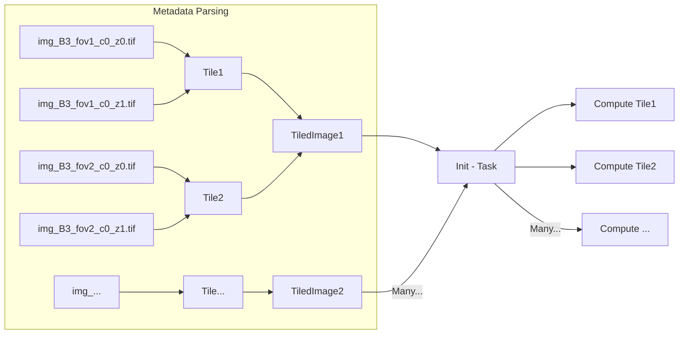

# Welcome to OME-Zarr Converters Tools

OME-Zarr Converters Tools is a Python package that provides tooling for building OME-Zarr converters.

It includes three main components:

1. Abstraction layer for mapping the on-disk raw data to Image objects
2. Common tooling to build converters as Fractal Compound Tasks

## Main Concepts

In general a single microscopy image is not acquired in a single big array in a single file, but rather in multiple smaller tiles. How atomic these tiles are depends on the specific microscope and the acquisition settings.

To make building converters easier, OME-Zarr Converters Tools provides an abstraction layer that allows you to map these on-disk raw data to an Image object which we call `Tile`.

Moreover, usually a single microscopy image is not composed of a single tile, but rather multiple tiles that are stitched together to form a complete image. We call these objects `TiledImage`.



Additional OME-Zarr Converters Tools supports high-content screening HCS applications. In the context of HCS it is common to have multiple images that are related to each other in a single plate collection. Plates are standardized in OME-Zarr and OME-Zarr Converters Tools provides the necessary tools to correctly place the images in a plate collection.

## Installation

To get started with OME-Zarr Converters Tools, you can install it via pip:

```bash
pip install ome-zarr-converters-tools
```
