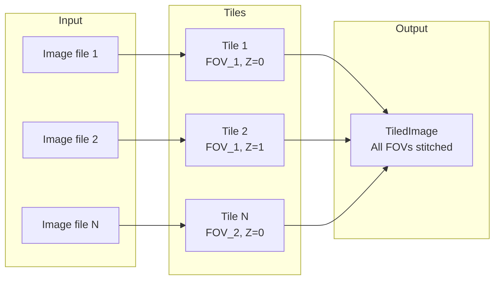
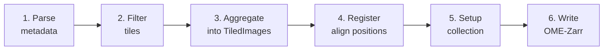

# Welcome to OME-Zarr Converters Tools

OME-Zarr Converters Tools is a Python library that provides shared utilities for building OME-Zarr image converters. It handles tile management, image registration, filtering, validation, and writing OME-Zarr datasets. Moreover, it offers [Fractal](https://fractal-analytics-platform.github.io/) specific utilities to facilitate building converters as Fractal tasks.

## Features

- **Abstraction layer** for building OME-Zarr images and HCS plates from microscope metadata and image data
- **Customizable pipeline** for filtering, validating, registering, and tiling images
- **Python API** for building custom converters, with optional Fractal integration for parallel processing
- **Flexible input**: parse tiles from DataFrames or construct them programmatically

## Main Concepts

A microscopy image is typically not acquired as a single file, but as multiple smaller **tiles**.
How atomic these tiles are depends on the microscope and the acquisition settings.

OME-Zarr Converters Tools provides an abstraction layer that maps on-disk raw data to `Tile` objects.
Multiple tiles are then aggregated into a `TiledImage` -- the composite object that represents one complete image in the output OME-Zarr dataset.



## Collection Types

The library supports two collection types for different acquisition structures:

- **HCS Plates**: for high-content screening applications where images are organized in a multi-well plate layout, following the OME-Zarr HCS specification.
- **Single Images**: for standalone OME-Zarr image conversions without plate structure.

## Pipeline Overview

The conversion pipeline follows these steps:



1. **Parse metadata** into `Tile` objects -- map raw images (e.g., TIFF files) to tiles with position, channel, and timepoint metadata
2. **Filter** tiles using custom filters to exclude unwanted data (e.g., failed acquisitions, specific channels)
3. **Aggregate** tiles into `TiledImage` objects that represent complete images with their final axis layout
4. **Register** tile positions to correct for stage inaccuracies and tile overlapping FOVs into mosaics
5. **Setup collection** -- create the HCS plate or single image structure with OME-Zarr metadata
6. **Write** OME-Zarr images to disk

See [Pipeline Configuration](pipeline.md) for details on filters, registration steps, tiling modes, and writer modes.

## Extensibility

The library is designed to be extended:

- **Custom image loaders**: implement `ImageLoaderInterface` to load any image format (see [Advanced Tutorial](advanced_tutorial.ipynb))
- **Custom pipeline steps**: add [registration](pipeline.md#custom-registration-steps), [filtering](pipeline.md#custom-filters), or validation steps
- **Custom collection types**: register new collection handlers via `add_collection_handler()`

## Installation

```bash
pip install ome-zarr-converters-tools
```
